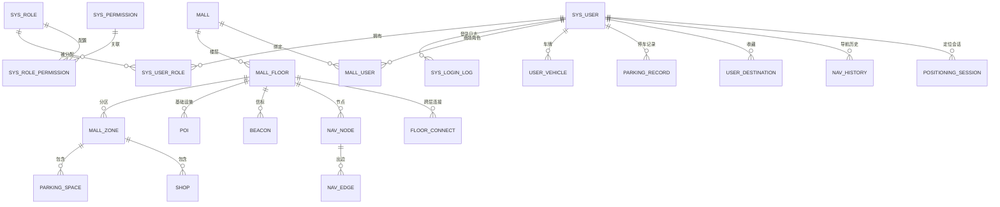

# 商场可视化智能车位/商铺导航系统 —— 数据库设计文档

版本: v0.2（已去除预留/可选设计，全字段中文注释）
适用环境: PostgreSQL 16 + PostGIS 3.x
配套脚本: [sql/00_init.sql](../sql/00_init.sql)、[sql/01_auth_db.sql](../sql/01_auth_db.sql)、[sql/02_business_db.sql](../sql/02_business_db.sql)

## 1. 核心场景

1. 用户进入商场地下车库，通过蓝牙信标扫描上报 RSSI，系统确定楼层与坐标。
2. 用户输入车位号或商铺名（支持模糊搜索），如 "B3-012"、"海底捞"。
3. 系统做路径规划，返回带几何的路径和分段指令："往左走 20 米，右转进入 B 区"。
4. 用户停车/导航后可收藏常去位置、查看历史路线，运营方可维护空间数据与信标。

## 2. 微服务、数据库与架构划分

全部表统一部署在同一个数据库 `postgis_36_sample` 中，按架构（schema）隔离：

| 服务 | 架构 | 职责 | 主要表 |
| --- | --- | --- | --- |
| auth-service（用户/认证） | auth | 登录注册、RBAC 权限 | sys_user、sys_role、sys_permission、sys_user_role、sys_role_permission、sys_login_log |
| business-service（业务） | business | 商场/楼层/分区/车位/商铺/POI/信标/导航图/停车/收藏/导航历史 | mall_*、parking_space、shop、poi、beacon、nav_*、parking_record |

拆分原则：

- 按"用户身份域"和"空间业务域"切分，两个架构之间不建物理外键，跨架构关联（如 `mall_user.user_id` 引用 `auth.sys_user`）只保存冗余 ID 并建索引，由应用层保证一致性。
- 主键统一使用应用层雪花 ID（BIGINT），不依赖数据库序列。

`postgis`、`pg_trgm` 为数据库级扩展，由 [sql/00_init.sql](../sql/00_init.sql) 安装一次；`auth`、`business` 两个架构由 01/02 脚本各自创建。

## 3. 空间数据建模原则

### 3.1 坐标系：楼层本地平面坐标（米）

- 所有室内几何统一使用"楼层本地平面坐标系"，单位米，SRID 约定为 0。
- `mall_floor.width_m / height_m` 记录平面图尺寸（米），前端按此渲染楼层平面。
- 距离直接用 `ST_Distance` 得到米，无投影畸变，保证"20 米"这类指令的准确性。

### 3.2 对象分层

`mall（商场）→ mall_floor（楼层）→ mall_zone（分区）→ 空间要素（车位/商铺/POI）`

每个空间要素表同时保存三个几何信息：

| 列 | 类型 | 用途 |
| --- | --- | --- |
| geom | Polygon/MultiPolygon | 要素轮廓，用于落区判断（用户定位点在哪） |
| center_point | Point | 要素中心，用于就近检索（KNN）与聚合展示 |
| entrance_point | Point | 入口/开口点，路径规划的终点（车头进车位的位置、商铺门口） |

### 3.3 导航图建模

- `nav_node` 是图中节点（通道点、岔路口、电梯口、车位入口、商铺入口等），带 `is_accessible` 支持临时封闭。
- `nav_edge` 是有向/双向边，`distance_m` 冗余存储用于路径规划，`weight` 做通行成本加权。
- `floor_connect` 记录跨楼层上下口绑定（电梯/扶梯/楼梯），跨楼层寻路时作为层间"跳边"。
- 路径规划（A*/Dijkstra）在应用层完成，DB 负责图数据、邻域查询、几何输出。
- 转向指令（直行/左转/右转/掉头）由应用层计算相邻两边的方位角差生成，也可用 `ST_Azimuth` 辅助。

## 4. 实体关系图



说明：虚线两侧跨架构（auth / business），均为逻辑关联，无物理外键。

## 5. 表设计总览

### auth 架构（用户中心）

| 表 | 用途 | 设计要点 |
| --- | --- | --- |
| sys_user | 用户账号（车主/运营/管理员/商户） | username、phone 唯一（部分唯一索引）；user_type 区分身份 |
| sys_role | 角色 | role_code 唯一；内置 ADMIN/MALL_OPERATOR/MERCHANT/USER |
| sys_permission | 权限点 | 菜单/按钮/API 三级，树形 parent_id |
| sys_user_role | 用户-角色关联 | 唯一 (user_id, role_id) |
| sys_role_permission | 角色-权限关联 | 唯一 (role_id, permission_id) |
| sys_login_log | 登录日志 | 记录登录成功/失败，按 user_id+时间索引 |

### business 架构（业务中心）

| 表 | 用途 | 设计要点 |
| --- | --- | --- |
| mall | 商场主数据 | mall_code 唯一 |
| mall_floor | 楼层 | (mall_id, floor_code) 唯一；记录平面图宽高（米） |
| mall_zone | 分区（B区/A区…） | (mall_id, floor_id, zone_code) 唯一；GIST 空间索引 |
| parking_space | 车位 | (mall_id, space_no) 唯一；状态机 FREE/OCCUPIED/LOCKED/FAULT；中心点+入口点 |
| shop_category | 商铺分类树 | mall_id 可空（平台通用分类） |
| shop | 商铺 | 名称+关键词 trgm 模糊搜索；中心点+入口点 |
| poi | 电梯/卫生间/出入口等 | poi_type 分类；GIST 索引 |
| beacon | 蓝牙信标 | (mall_id, uuid, major, minor) 唯一；布点坐标、RSSI 校准参数 |
| nav_node | 导航节点 | 节点类型枚举；is_accessible 支持封路 |
| nav_edge | 导航边 | (from, to) 唯一；distance_m 冗余、weight 加权 |
| floor_connect | 跨楼层连接 | 上下口绑定、折算成本 |
| mall_user | 用户-商场绑定 | 商场维度角色 |
| user_vehicle | 用户车牌 | (user_id, plate_no) 唯一 |
| parking_record | 停车记录 | user_id 可空（支持未登录）；按 mall_id/时间索引 |
| user_destination | 用户收藏 | (user_id, mall_id, target_type, target_id) 唯一 |
| nav_history | 导航历史 | 保存整条 path_geom 供回放 |
| positioning_session | 定位会话 | 最近定位点、精度、会话状态 |
| op_log | 操作日志 | detail JSONB，审计用 |

## 6. 关键状态机

| 表 | 字段 | 取值 |
| --- | --- | --- |
| parking_space | status | FREE 空闲 / OCCUPIED 占用 / LOCKED 锁定 / FAULT 故障 |
| shop | status | OPEN 营业 / DECORATING 装修 / CLOSED 关闭 |
| beacon | status | ACTIVE 正常 / INACTIVE 停用 / FAULT 故障 |
| parking_record | status | PARKING 停车中 / ENDED 已结束 / CANCELLED 已取消 |

枚举取值以 SQL 中字段中文注释为准，应用层统一校验。

## 7. 关键 PostGIS 查询示例

### 7.1 定位点落在哪个车位/分区

```sql
SELECT f.floor_code, z.zone_code, s.space_no
FROM parking_space s
JOIN mall_floor f ON f.id = s.floor_id
LEFT JOIN mall_zone z ON z.id = s.zone_id
WHERE s.mall_id = :mall_id
  AND s.deleted = 0
  AND ST_Contains(s.geom, ST_SetSRID(ST_MakePoint(:x, :y), 0));
```

### 7.2 当前位置附近 N 个空闲车位（KNN，走 GIST 索引）

```sql
SELECT s.id, s.space_no, s.space_type,
       ST_Distance(s.center_point, ST_SetSRID(ST_MakePoint(:x, :y), 0)) AS dist_m
FROM parking_space s
WHERE s.mall_id = :mall_id
  AND s.status = 'FREE'
  AND s.deleted = 0
ORDER BY s.center_point <-> ST_SetSRID(ST_MakePoint(:x, :y), 0)
LIMIT 10;
```

### 7.3 商铺/车位模糊搜索（pg_trgm）

```sql
SELECT id, shop_name, floor_id
FROM shop
WHERE mall_id = :mall_id
  AND deleted = 0
  AND (shop_name ILIKE '%' || :kw || '%'
       OR keywords ILIKE '%' || :kw || '%')
ORDER BY sort_order, id
LIMIT 20;
```

### 7.4 路径几何输出 GeoJSON（给前端可视化）

```sql
SELECT ST_AsGeoJSON(
    ST_LineMerge(ST_Collect(e.geom ORDER BY e.id))
) AS path_geojson
FROM nav_edge e
WHERE e.id = ANY(:edge_ids);
```

### 7.5 转向角计算（辅助生成"左转/右转"指令）

```sql
-- 相邻两条边的方位角差, 应用层据此判定: <30° 直行 / 30°~150° 左右转 / >150° 掉头
SELECT ST_Degrees(ST_Azimuth(
    (SELECT geom FROM nav_edge WHERE id = :prev_id),
    (SELECT geom FROM nav_edge WHERE id = :next_id)
)) AS turn_angle;
```

## 8. 索引与约束约定

- 主键全部为应用层雪花 ID（BIGINT），避免跨服务依赖数据库序列。
- 唯一性约束用"部分唯一索引"实现：`UNIQUE ... WHERE deleted = 0`，与逻辑删除兼容。
- 空间列统一 GIST 索引（geom / center_point / position_geom / path_geom）。
- 文本模糊搜索用 `pg_trgm` 的 GIN 索引（shop_name、keywords、space_no）。
- 跨表字段（mall_id、floor_id、user_id 等）只建 BTree 索引，不建物理外键，由应用层保证一致性，便于服务独立部署。
- 时间字段统一 `TIMESTAMPTZ`，应用与数据库同一时区（Asia/Shanghai）。

## 9. 执行顺序

1. 执行 [sql/00_init.sql](../sql/00_init.sql)：在 PostgreSQL 实例上创建 `postgis_36_sample` 数据库，并安装 `postgis`、`pg_trgm` 扩展。
2. 执行 [sql/01_auth_db.sql](../sql/01_auth_db.sql)：在 `postgis_36_sample` 的 `auth` 架构下创建用户中心表。
3. 执行 [sql/02_business_db.sql](../sql/02_business_db.sql)：在 `postgis_36_sample` 的 `business` 架构下创建业务表。
4. 生成 MyBatis-Plus 实体：配置雪花 ID（IdType.ASSIGN_ID）、逻辑删除、MetaObjectHandler 自动填充；geometry 字段配置 PGgeometry/JTS TypeHandler 或统一以 GeoJSON 字符串传输。
5. 数据库连接需指定架构：auth-service 的 JDBC URL 加 `?currentSchema=auth`，business-service 加 `?currentSchema=business`；也可在实体上用 `@TableName("auth.sys_user")` 等限定。
